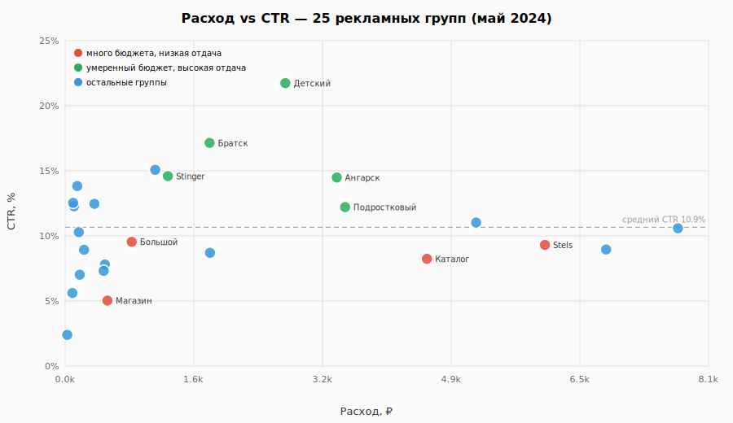

# Распределение бюджета и доли кликов по 25 рекламным группам

Статус: выполнен  
Канбан: seg-pareto-groups  
Зависимости: нет → эта карточка → seg-targeting

---

## 1. Описание эксперимента и зачем

Часть бюджета может уходить в рекламные группы с низкой долей кликов при большом расходе. Нужно увидеть, насколько распределение денег по 25 группам соответствует их отдаче.

Цель: построить таблицу и наглядную диаграмму «расход группы — доля кликов (CTR)» и выделить группы с перекосом (много денег, мало кликов на показ).

Зачем в гипотезе: подтвердить или опровергнуть, что крупные по бюджету группы вроде «Велосипед Каталог» отстают по отдаче от узких групп вроде «Велосипед Детский».

Что не является целью:

- разбирать категории таргетинга (карточка seg-targeting);
- симулировать перенос бюджета (блок устранения);
- анализировать формат объявлений (другая причина в дереве).

---

## 2. Основная метрика (финальный тест)

Для каждой из 25 рекламных групп — расход в рублях, доля от общего бюджета кампании, число кликов, доля кликов (CTR) и клики на 1000 ₽ расхода.

### Определение

| Параметр | Значение |
|----------|----------|
| Метрика | клики на 1000 ₽ = клики ÷ расход × 1000; вторично — доля кликов (CTR) |
| Агрегация | сумма по колонке «Группа» в выгрузке Centra Market — велосипеды, май 2024 |
| Общий бюджет | 50 005 ₽ (ориентир для доли расхода) |
| Примеры перекоса | «Велосипед Каталог» ~4 566 ₽ при CTR ~8,4%; «Велосипед Детский» ~2 780 ₽ при CTR ~22,1% |
| Скрипт / артефакты | лок.: `datasets/bicycle.csv`; табл. A и диаграмма в §4.1 |

---

## 3. Постановки и подготовка

### 3.1 Агрегация по рекламным группам → §4

Кратко: сгруппировать все строки по «Группа», посчитать метрики, отсортировать по расходу.

- Используемые данные: выгрузка Centra Market — велосипеды, май 2024; лок.: `datasets/bicycle.csv`, 25 уникальных значений «Группа»
- Колонки: «Группа», «Показы», «Клики», «Расход (руб.)»
- Визуализация: точечная или столбчатая диаграмма — ось X расход, ось Y доля кликов (или клики на 1000 ₽)
- Статус: выполнен → [§4](#4-эксперимент-1--разбивка-по-группам)

Подзадачи:

- [x] Агрегировать по «Группа»: показы, клики, расход; посчитать CTR, CPC, клики на 1000 ₽, долю бюджета
- [x] Заполнить табл. A для всех 25 групп (сортировка по расходу по убыванию)
- [x] Построить диаграмму расход vs CTR (или клики на 1000 ₽); сохранить в `assets/` при работе через UI
- [x] В §4.2: назвать минимум две группы с перекосом «много расхода — низкая отдача» и две с обратным паттерном

#### Сбор данных

Готовый CSV из `datasets/bicycle.csv`.

```bash
python3 -c "
import csv
from collections import defaultdict
d=defaultdict(lambda:{'i':0,'c':0,'s':0.0})
for r in csv.DictReader(open('datasets/bicycle.csv', encoding='utf-8')):
    g=r['Группа']
    d[g]['i']+=float(r['Показы'] or 0); d[g]['c']+=float(r['Клики'] or 0); d[g]['s']+=float(r['Расход (руб.)'] or 0)
for g,v in sorted(d.items(), key=lambda x:-x[1]['s']):
    ctr=v['c']/v['i']*100 if v['i'] else 0
    cpk=v['c']/v['s']*1000 if v['s'] else 0
    print(f'{g}: {v[\"s\"]:.0f}₽ CTR {ctr:.1f}% {cpk:.1f} кл/1000₽')
"
```

### 3.2 Критерий завершения карточки

| Проверка | Результат |
|----------|-----------|
| Табл. A: 25 строк | да |
| Диаграмма или описание перекоса Каталог vs Детский | да |
| Вывод §4.2 о сегментном перекосе бюджета | да |

---

## 4. Эксперимент 1 — разбивка по группам

Постановка — [§3.1](#31-агрегация-по-рекламным-группам--4).

### 4.1 Результаты

#### Таблица A. Рекламные группы по расходу и отдаче

Протокол: выгрузка Centra Market — велосипеды, май 2024; §2. Сортировка по расходу по убыванию; общий бюджет 50 005 ₽, 1 391 клик.

| Рекламная группа | Показы | Клики | Расход, ₽ | Доля бюджета, % | Доля кликов, % | Клики на 1000 ₽ |
|------------------|--------|-------|-----------|-----------------|----------------|-----------------|
| Велосипед Иркутск | 1 809 | 195 | 7 734 | 15,5 | 10,78 | 25,2 |
| Велосипед Купить | 2 314 | 211 | 6 827 | 13,7 | 9,12 | 30,9 |
| Велосипед Stels | 1 520 | 144 | 6 055 | 12,1 | 9,47 | 23,8 |
| Веломагазин | 1 167 | 131 | 5 187 | 10,4 | 11,23 | 25,3 |
| Велосипед Каталог | 1 049 | 88 | 4 566 | 9,1 | 8,39 | 19,3 |
| Велосипед Подростковый | 732 | 91 | 3 533 | 7,1 | 12,43 | 25,8 |
| Велосипед Ангарск | 800 | 118 | 3 429 | 6,9 | 14,75 | 34,4 |
| Велосипед Детский | 375 | 83 | 2 780 | 5,6 | 22,13 | 29,9 |
| Велик Купить / Цена | 621 | 55 | 1 828 | 3,7 | 8,86 | 30,1 |
| Велосипед Братск | 361 | 63 | 1 824 | 3,6 | 17,45 | 34,5 |
| Велосипед Stinger | 323 | 48 | 1 297 | 2,6 | 14,86 | 37,0 |
| Велосипед +для лет/года | 215 | 33 | 1 137 | 2,3 | 15,35 | 29,0 |
| Велосипед Большой | 175 | 17 | 839 | 1,7 | 9,71 | 20,3 |
| Велосипед Магазин | 293 | 15 | 533 | 1,1 | 5,12 | 28,1 |
| Велосипед Трехколесный | 239 | 19 | 501 | 1,0 | 7,95 | 37,9 |
| Велосипед Интернет | 161 | 12 | 486 | 1,0 | 7,45 | 24,7 |
| Велосипед Складной | 134 | 17 | 370 | 0,7 | 12,69 | 46,0 |
| Велик ГЕО | 110 | 10 | 239 | 0,5 | 9,09 | 41,9 |
| Велосипед Новый | 28 | 2 | 184 | 0,4 | 7,14 | 10,9 |
| Велосипед Горный | 105 | 11 | 173 | 0,3 | 10,48 | 63,7 |
| Велосипед Женский | 71 | 10 | 153 | 0,3 | 14,08 | 65,3 |
| Велосипед Novatrack | 56 | 7 | 112 | 0,2 | 12,50 | 62,4 |
| Велосипед Девочке | 47 | 6 | 101 | 0,2 | 12,77 | 59,4 |
| Велосипед Favorit | 70 | 4 | 91 | 0,2 | 5,71 | 43,9 |
| Велосипед Ребенку | 41 | 1 | 26 | 0,1 | 2,44 | 38,0 |

Диаграмма: 

На диаграмме видно расхождение: группы с расходом выше 4 000 ₽ и CTR ниже среднего по кампании (~10,9%) лежат в левом нижнем «тяжёлом» кластере; узкие группы с высокой отдачей — выше и левее (меньше бюджета, выше CTR).

### 4.2 Выводы

**Гипотеза о сегментном перекосе подтверждается.** Четыре группы из пяти с наибольшим расходом (Иркутск, Купить, Stels, Каталог) суммарно получают **60,3%** бюджета при среднем CTR **9,4%** — ниже среднего по кампании (**10,85%**). При этом «Велосипед Каталог» — пятая по расходу группа (**9,1%** бюджета, **4 566 ₽**) при CTR **8,39%** и всего **19,3** клика на 1000 ₽ — худшая отдача среди крупных сегментов; цифры совпадают с ориентиром карточки.

**Группы с перекосом «много расхода — низкая отдача»:**

1. **Велосипед Каталог** — 9,1% бюджета при CTR 8,39% (на 2,5 п.п. ниже среднего); CPC 51,9 ₽.
2. **Велосипед Stels** — 12,1% бюджета (вторая по расходу) при CTR 9,47% и 23,8 кл/1000 ₽.
3. **Велосипед Купить** — 13,7% бюджета при CTR 9,12%.
4. **Велосипед Большой** — скромный абсолютный расход (839 ₽), но CTR 9,71% при CPC 49,4 ₽ — типичный «дорогой» сегмент.

**Группы с обратным паттерном «умеренный расход — высокая отдача»:**

1. **Велосипед Детский** — 5,6% бюджета (**2 780 ₽**) при CTR **22,13%** (в 2,6 раза выше среднего); ориентир карточки подтверждён.
2. **Велосипед Ангарск** — 6,9% бюджета при CTR 14,75% и **34,4** кл/1000 ₽ — лучшая отдача на рубль среди групп с расходом > 3 000 ₽.
3. **Велосипед Братск** — 3,6% бюджета при CTR 17,45%.
4. **Велосипед Stinger** — 2,6% бюджета при CTR 14,86% и 37,0 кл/1000 ₽.

Итог: бюджет сконцентрирован в широких гео- и брендовых группах с CTR около 9%, тогда как узкие intent-группы (детский, подростковый, ангарск) получают меньшую долю денег при заметно более высокой конверсии показов в клики. Это аргумент в пользу перераспределения (следующий блок `r-reallocate-budget`) и мотивирует карточку seg-targeting по категориям запросов.

Статус прогона: выполнен
